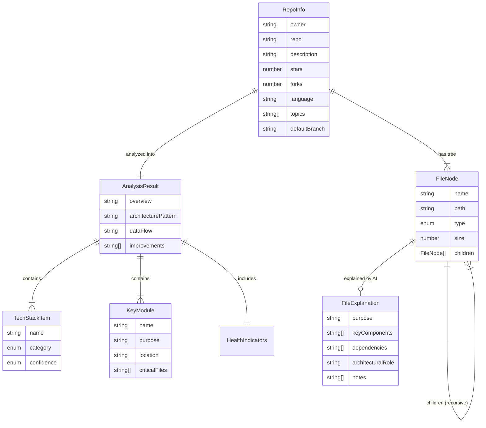

# 🗃️ RepoLens AI — Data Models Document

> **Version:** 1.0  
> **Date:** March 2025  
> **Author:** Sumit (B.Tech 3rd Year, CSE)  
> **Status:** Implemented

---

## 1. Overview

RepoLens AI uses **TypeScript interfaces** as its primary data modeling layer. Since the application is a stateless SPA with no database (all data is fetched in real-time from GitHub and Gemini APIs), our data models define the **shape of data flowing through the system** rather than database schemas.

All type definitions are centralized in `src/types/repo.ts` for maintainability and single-source-of-truth.

---

## 2. Core Data Models

### 2.1 `RepoInfo` — Repository Metadata

Represents the basic metadata of a GitHub repository, fetched from the GitHub REST API (`GET /repos/{owner}/{repo}`).

```typescript
export interface RepoInfo {
  owner: string;        // GitHub username or org (e.g., "facebook")
  repo: string;         // Repository name (e.g., "react")
  description: string;  // Repo description or "No description"
  stars: number;        // Stargazer count
  forks: number;        // Fork count
  language: string;     // Primary language (e.g., "TypeScript")
  topics: string[];     // Repository topics/tags
  defaultBranch: string; // Default branch name (e.g., "main")
}
```

| Field | Source | Transformation |
|---|---|---|
| `owner` | Parsed from user input URL | `parseGitHubUrl()` extracts owner |
| `repo` | Parsed from user input URL | `.git` suffix stripped |
| `description` | GitHub API `description` | Defaults to `"No description"` if null |
| `stars` | GitHub API `stargazers_count` | Direct mapping |
| `forks` | GitHub API `forks_count` | Direct mapping |
| `language` | GitHub API `language` | Defaults to `"Unknown"` if null |
| `topics` | GitHub API `topics` | Defaults to `[]` if null |
| `defaultBranch` | GitHub API `default_branch` | Direct mapping |

**Used By:** `RepoHeader.tsx`, `useRepoAnalysis.ts`, `Index.tsx`

---

### 2.2 `FileNode` — File Tree Node

Represents a single node in the repository's file tree. This is a **recursive data structure** — directories contain an array of child `FileNode`s.

```typescript
export interface FileNode {
  name: string;           // File/directory name (e.g., "src")
  path: string;           // Full path relative to repo root (e.g., "src/App.tsx")
  type: "file" | "dir";   // Node type
  size?: number;          // File size in bytes (only for files)
  children?: FileNode[];  // Child nodes (only for directories)
}
```

#### Tree Construction Logic

The GitHub Git Trees API returns a **flat list** of all files. We convert this to a nested tree structure:

```
GitHub API (flat):                    Our Model (nested):
─────────────────                     ────────────────────
src (tree)                            FileNode {
src/App.tsx (blob)                      name: "src",
src/main.tsx (blob)                     type: "dir",
src/components (tree)         →         children: [
src/components/Header.tsx (blob)          { name: "App.tsx", type: "file" },
                                          { name: "main.tsx", type: "file" },
                                          { name: "components", type: "dir",
                                            children: [
                                              { name: "Header.tsx", type: "file" }
                                            ]
                                          }
                                        ]
                                      }
```

**Key Design Decisions:**
- **Depth Limit:** Tree is limited to 3 levels deep to avoid overwhelming the UI and API payload
- **Sorting:** Directories come first, then alphabetical within each type
- **Lazy Loading:** File content is NOT included in the tree — it's fetched on-demand when a user clicks a file

**Used By:** `FileTree.tsx`, `FileViewer.tsx`, `Index.tsx`, `github.ts`

---

### 2.3 `TechStackItem` — Detected Technology

Represents a single technology detected in the repository by the AI analysis.

```typescript
export interface TechStackItem {
  name: string;                                                          // Technology name (e.g., "React")
  category: "frontend" | "backend" | "database" | "devops" | "testing" | "other";  // Classification
  confidence: "high" | "medium" | "low";                                 // Detection confidence
}
```

#### Category Taxonomy

| Category | Examples | Detection Source |
|---|---|---|
| `frontend` | React, Vue, Angular, Tailwind CSS | `package.json` dependencies, config files |
| `backend` | Express, FastAPI, Django | `requirements.txt`, `package.json`, folder structure |
| `database` | PostgreSQL, MongoDB, Redis | Docker configs, ORM files, connection strings |
| `devops` | Docker, GitHub Actions, Vercel | `Dockerfile`, `.github/workflows/`, deployment configs |
| `testing` | Jest, Vitest, Pytest | `package.json` devDependencies, test directories |
| `other` | TypeScript, ESLint, Prettier | Config files, devDependencies |

#### Confidence Levels

| Level | Meaning | Example |
|---|---|---|
| `high` | Explicitly declared dependency | Found in `package.json` or `requirements.txt` |
| `medium` | Inferred from config files | Found `tailwind.config.ts` but not in dependencies |
| `low` | Inferred from code patterns | Detected usage patterns but no explicit declaration |

**Used By:** `TechStack.tsx`

---

### 2.4 `KeyModule` — Important Module

Represents a key architectural module identified by the AI.

```typescript
export interface KeyModule {
  name: string;           // Module name (e.g., "Authentication Module")
  purpose: string;        // What this module does
  location: string;       // Directory path (e.g., "src/auth/")
  criticalFiles: string[]; // Most important files in this module
}
```

**Example Data:**

```json
{
  "name": "API Layer",
  "purpose": "Handles all communication between frontend and serverless backend functions",
  "location": "src/lib/",
  "criticalFiles": ["src/lib/github.ts"]
}
```

**Used By:** `KeyModules.tsx`

---

### 2.5 `AnalysisResult` — Complete AI Analysis

The main output model from the Gemini AI analysis. This is the **most complex data model** in the application and contains all the structured intelligence about the repository.

```typescript
export interface AnalysisResult {
  overview: string;                    // 2-3 sentence project summary
  techStack: TechStackItem[];          // Detected technologies
  architecturePattern: string;         // Architecture description (e.g., "MVC", "Microservices")
  dataFlow: string;                    // How data moves through the system
  keyModules: KeyModule[];             // Important modules list
  healthIndicators: {
    documentation: "good" | "average" | "poor";
    codeOrganization: "well-structured" | "needs-improvement";
    maturity: "production-ready" | "beta" | "experimental";
  };
  improvements: string[];              // Suggested improvements
}
```

#### Health Indicators Detail

| Indicator | Values | What AI Looks For |
|---|---|---|
| `documentation` | `good`, `average`, `poor` | README quality, inline comments, JSDoc |
| `codeOrganization` | `well-structured`, `needs-improvement` | Folder structure, separation of concerns, naming |
| `maturity` | `production-ready`, `beta`, `experimental` | Test coverage, CI/CD, error handling, versioning |

**Used By:** `OverviewCard.tsx`, `TechStack.tsx`, `KeyModules.tsx`, `Insights.tsx`

---

### 2.6 `FileExplanation` — AI File Explanation

Represents the AI-generated explanation of a single file. Note: this interface is defined but the actual API returns a plain text string. The interface serves as a reference for the structured data the AI is prompted to generate.

```typescript
export interface FileExplanation {
  purpose: string;           // One-sentence purpose
  keyComponents: string[];   // Main functions/classes
  dependencies: string[];    // Import dependencies
  architecturalRole: string; // Where it fits in the system
  notes: string[];           // Critical logic, gotchas
}
```

**Used By:** `Index.tsx` (as plain text from API), `FileViewer.tsx`

---

## 3. Internal State Models

### 3.1 `AnalysisState` — Hook Internal State

The `useRepoAnalysis` hook manages the full analysis lifecycle through this internal state:

```typescript
interface AnalysisState {
  repoInfo: RepoInfo | null;      // null until step 1 completes
  fileTree: FileNode[];            // empty until step 2 completes
  analysis: AnalysisResult | null; // null until step 4 completes
  isLoading: boolean;              // true during analysis, false otherwise
  loadingStep: number;             // 0-4, tracks current step for UI progress
  error: string | null;            // error message if analysis fails
}
```

#### State Machine Flow

```
IDLE (initial)
  │
  ▼  analyze() called
LOADING (step 0)
  │
  ├──→ step 1: repoInfo fetched
  ├──→ step 2: fileTree fetched
  ├──→ step 3: keyFiles fetched, sent to AI
  ├──→ step 4: analysis parsed ──→ SUCCESS (isLoading=false)
  │
  └──→ Any error ──→ ERROR (isLoading=false, error set)
  
  reset() called from any state ──→ IDLE
```

---

## 4. API Request/Response Models

### 4.1 GitHub Proxy Request

```typescript
// POST /api/github
interface GitHubProxyRequest {
  action: "repoInfo" | "repoTree" | "fileContent";
  owner: string;
  repo: string;
  path?: string;  // Only for fileContent action
}
```

### 4.2 Analysis Request

```typescript
// POST /api/analyze
interface AnalyzeRequest {
  owner: string;
  repo: string;
  description: string;
  language: string;
  treeString: string;           // ASCII tree (max 5000 chars)
  keyFiles: Record<string, string>; // { "path": "content" } (max 8 files, each max 10000 chars)
}
```

### 4.3 Explain Request

```typescript
// POST /api/explain
interface ExplainRequest {
  filePath: string;  // e.g., "src/App.tsx"
  content: string;   // File content (max 8000 chars)
}
```

---

## 5. Local Storage Data

### 5.1 Recent Repos

```typescript
// Key: "repolens-recent"
// Type: string[]
// Max: 10 entries (FIFO, deduplication enforced)
// Example: ["facebook/react", "vercel/next.js", "expressjs/express"]
```

**Persistence Strategy:**
- Stored as JSON string in `localStorage`
- New entries added to front, duplicates removed
- Limited to 10 most recent entries
- Managed by `useLocalStorage` hook with generic type support

---

## 6. Data Model Relationship Diagram



---

## 7. Data Validation & Error Handling

### 7.1 Input Validation

| Input | Validation | Location |
|---|---|---|
| GitHub URL | Regex pattern matching (`github.com/owner/repo` or `owner/repo`) | `parseGitHubUrl()` in `github.ts` |
| File content | Truncated to 8000 chars before sending to AI | `explain.js` API route |
| Tree string | Truncated to 5000 chars before sending to AI | `analyze.js` API route |
| Key files | Max 8 files, each max 10000 chars | `fetchKeyFiles()` in `github.ts` |

### 7.2 Response Validation

| Response | Validation | Fallback |
|---|---|---|
| Gemini JSON | Strip markdown fences, JSON.parse | "Failed to parse AI response. Please try again." |
| GitHub API | HTTP status code check | Specific error messages for 404, 403, 500 |
| File content | Base64 encoding check | Decode with `atob()` if base64 |

---

## 8. Design Decisions & Trade-offs

| Decision | Rationale | Trade-off |
|---|---|---|
| **No database** | Simplicity, zero infrastructure cost, no auth needed | No persistent history across devices |
| **TypeScript interfaces (not classes)** | Lighter weight, better for data transfer objects | No methods on models, pure data |
| **Flat type file** | All types in one file for easy discovery | Could become unwieldy in larger projects |
| **localStorage for persistence** | Simple, no backend needed, instant access | Limited to ~5MB, per-browser only |
| **AI-generated JSON** | Rich structured analysis without manual parsing | Occasional parsing failures, AI hallucination risk |
| **Tree depth limit (3 levels)** | Prevents UI overload and API timeout | Some deeply nested files not visible in tree |

---

*Document maintained by Sumit . Last updated: March 2025.*
