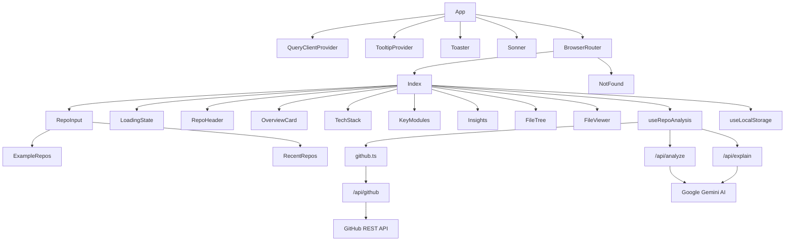
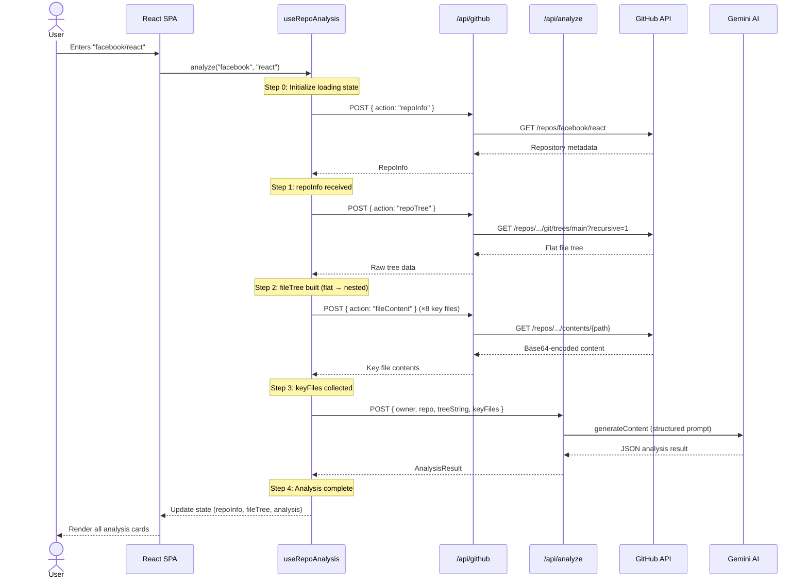
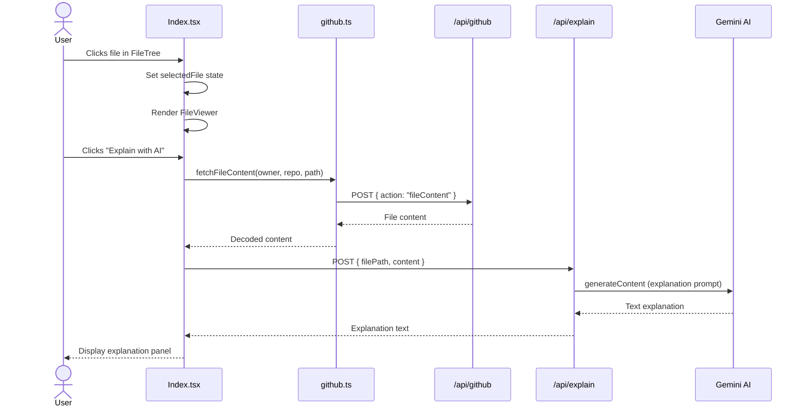

# 🎨🏗️ RepoLens AI — Design System & System Design

> **Version:** 1.0  
> **Date:** March 2025  
> **Author:** Sumit (B.Tech 3rd Year, CSE)  
> **Status:** Implemented

---

# Part A: Design System

## 1. Design Philosophy

RepoLens AI follows a **modern, developer-focused design philosophy** that balances aesthetics with readability. The UI is designed to feel premium, clean, and functional — similar to tools like Vercel Dashboard, Linear, and Raycast.

### Core Principles

| Principle | Application |
|---|---|
| **Glassmorphism** | Cards use semi-transparent backgrounds with backdrop blur for depth |
| **Micro-animations** | Framer Motion used for entrance animations, hover effects, and state transitions |
| **Information Density** | Maximum information displayed without clutter using compact spacing |
| **Dark Mode First** | Designed primarily for dark mode with full light mode support |
| **Developer Aesthetic** | Monospace fonts for code, gradient accents for headings, badge-based tech displays |

---

## 2. Color System

### 2.1 Token Architecture

Colors are defined as **HSL CSS custom properties** in `src/index.css`, consumed via Tailwind utility classes. This enables seamless light/dark mode switching through CSS class toggling.

```css
/* Color token structure */
--color-name: <hue> <saturation>% <lightness>%;

/* Usage in Tailwind */
background: hsl(var(--background));
```

### 2.2 Light Theme Palette

| Token | HSL Value | Preview | Purpose |
|---|---|---|---|
| `--background` | `210 20% 98%` | Near white | Page background |
| `--foreground` | `222 47% 11%` | Dark navy | Primary text |
| `--card` | `0 0% 100%` | Pure white | Card backgrounds |
| `--primary` | `239 84% 67%` | **Indigo/Blue** | Primary actions, links, accents |
| `--secondary` | `210 20% 96%` | Light gray | Secondary backgrounds |
| `--accent` | `160 84% 39%` | **Emerald Green** | Success, accent highlights |
| `--muted` | `210 20% 96%` | Light gray | Muted backgrounds |
| `--muted-foreground` | `215 16% 47%` | Medium gray | Secondary text |
| `--destructive` | `0 84% 60%` | Red | Errors, destructive actions |
| `--border` | `214 32% 91%` | Light border | Subtle borders |
| `--ring` | `239 84% 67%` | Indigo | Focus rings |
| `--success` | `160 84% 39%` | Green | Success states |
| `--warning` | `38 92% 50%` | Amber/Orange | Warning states |

### 2.3 Dark Theme Palette

| Token | HSL Value | Preview | Purpose |
|---|---|---|---|
| `--background` | `222 47% 6%` | Very dark navy | Page background |
| `--foreground` | `210 40% 98%` | Near white | Primary text |
| `--card` | `222 47% 9%` | Dark card | Card backgrounds |
| `--primary` | `239 84% 67%` | Same indigo | Primary (consistent across themes) |
| `--secondary` | `217 33% 17%` | Dark gray-blue | Secondary backgrounds |
| `--muted` | `217 33% 17%` | Dark gray-blue | Muted backgrounds |
| `--muted-foreground` | `215 20% 65%` | Medium-light gray | Secondary text |
| `--destructive` | `0 63% 31%` | Dark red | Errors (toned down for dark mode) |
| `--border` | `217 33% 17%` | Dark border | Subtle borders |

### 2.4 Sidebar-Specific Colors

Dedicated sidebar color tokens for potential sidebar implementation:

```css
--sidebar-background: 240 5.9% 10%;
--sidebar-foreground: 240 4.8% 95.9%;
--sidebar-primary: 224.3 76.3% 48%;
--sidebar-accent: 240 3.7% 15.9%;
--sidebar-border: 240 3.7% 15.9%;
```

---

## 3. Typography

### 3.1 Font Stack

```css
/* Primary (UI text) */
font-family: 'Inter', system-ui, sans-serif;

/* Monospace (Code) */
font-family: 'JetBrains Mono', monospace;
```

Both fonts are loaded from Google Fonts with optimized weight subsets:
- **Inter:** 300 (Light), 400 (Regular), 500 (Medium), 600 (SemiBold), 700 (Bold), 800 (ExtraBold)
- **JetBrains Mono:** 400 (Regular), 500 (Medium), 600 (SemiBold)

### 3.2 Type Scale (Applied)

| Element | Class / Size | Weight | Usage |
|---|---|---|---|
| App title | `text-4xl md:text-5xl` | `font-bold` | "RepoLens AI" hero text |
| Repo name | `text-2xl` | `font-bold` | Repository name in header |
| Section headings | `text-lg` | `font-semibold` | Card section titles |
| Sub-headings | `text-sm` | `font-semibold` or `font-medium` | Subsection labels |
| Body text | `text-sm` | Regular | Descriptions, content |
| Small text | `text-xs` | Regular | Metadata, badges, file paths |
| Tiny text | `text-[10px]` | Regular | Health indicator labels |

---

## 4. Spacing & Layout

### 4.1 Border Radius

```css
--radius: 0.75rem;  /* 12px — base radius */
```

| Size | Value | Usage |
|---|---|---|
| `rounded-xl` | `0.75rem` | Cards, containers |
| `rounded-lg` | `calc(0.75rem)` | Inner sections, code blocks |
| `rounded-md` | `calc(0.75rem - 2px)` | Badges, tech stack items |
| `rounded-full` | `9999px` | Pill badges, example repo buttons |

### 4.2 Container

```css
container: {
  center: true,
  padding: "2rem",
  screens: { "2xl": "1400px" }
}
```

The main content is capped at `max-w-7xl` (80rem = 1280px) with `px-4` padding.

### 4.3 Grid Layout

The results page uses a **responsive 3-column grid**:

```
Desktop (lg+):
┌──────────────────┬─────────────┐
│  Overview        │  Insights   │
│  Tech Stack      │  File Tree  │
│  Key Modules     │             │
│  (2 cols)        │  (1 col)    │
└──────────────────┴─────────────┘

Mobile:
┌──────────────────┐
│  Overview        │
│  Tech Stack      │
│  Key Modules     │
│  Insights        │
│  File Tree       │
└──────────────────┘
```

---

## 5. Custom Utility Classes

Defined in `src/index.css` under `@layer utilities`:

### 5.1 `glass-card`

```css
.glass-card {
  @apply bg-card/80 backdrop-blur-xl border border-border/50 shadow-lg;
}
```

A glassmorphic card with semi-transparent background, blur effect, and subtle border. Used for every major card in the analysis view.

### 5.2 `gradient-text`

```css
.gradient-text {
  @apply bg-clip-text text-transparent bg-gradient-to-r from-primary to-accent;
}
```

Gradient text effect used for the "RepoLens" brand name — transitions from indigo (primary) to emerald (accent).

### 5.3 `glow-primary`

```css
.glow-primary {
  box-shadow: 0 0 40px -12px hsl(var(--primary) / 0.4);
}
```

A soft indigo glow effect for emphasis. Used sparingly for premium feel.

### 5.4 `animate-typewriter`

```css
.animate-typewriter {
  overflow: hidden;
  white-space: nowrap;
  animation: typewriter 2s steps(40, end);
}
```

Typewriter text reveal animation for loading states.

---

## 6. Animation System

### 6.1 Framer Motion Patterns

All components use consistent staggered entrance animations:

| Pattern | Config | Usage |
|---|---|---|
| **Fade Up** | `initial={{ opacity: 0, y: 12 }}, animate={{ opacity: 1, y: 0 }}` | Cards entering viewport |
| **Fade Left** | `initial={{ opacity: 0, x: -12 }}, animate={{ opacity: 1, x: 0 }}` | List items staggering in |
| **Fade Right** | `initial={{ opacity: 0, x: 12 }}, animate={{ opacity: 1, x: 0 }}` | AI explanation panel |
| **Scale In** | `initial={{ scale: 0.8, opacity: 0 }}, animate={{ scale: 1, opacity: 1 }}` | Badge/pill entrance |
| **Collapse/Expand** | `initial={{ height: 0, opacity: 0 }}, animate={{ height: "auto", opacity: 1 }}` | File tree expand |
| **Spin** | `animate={{ rotate: 360 }}, transition={{ duration: 2, repeat: Infinity }}` | Loading spinner |

### 6.2 Stagger Delays

```
Card 0:  delay: 0.00s  (RepoHeader)
Card 1:  delay: 0.05s  (OverviewCard)
Card 2:  delay: 0.10s  (TechStack)
Card 3:  delay: 0.20s  (KeyModules)
Card 4:  delay: 0.30s  (Insights)
Card 5:  delay: 0.40s  (FileTree)
Items:   delay: 0.30 + index * 0.05s  (within KeyModules)
```

### 6.3 Tailwind Keyframes

```css
/* Accordion expand/collapse */
accordion-down: 0.2s ease-out  (height: 0 → auto)
accordion-up: 0.2s ease-out    (height: auto → 0)

/* Loading step indicator */
pulse-glow: 2s ease-in-out infinite  (opacity: 0.4 → 1 → 0.4)
```

---

## 7. Component Library (Shadcn/UI)

The project uses **40+ Shadcn/UI components** built on Radix UI primitives. These provide accessible, unstyled headless components that we style with Tailwind.

### Actively Used Components

| Component | Usage in App |
|---|---|
| `Badge` | Repository topics display |
| `Button` | Actions (Analyze, Back, Explain, Copy) |
| `Card` | Not directly used (custom glass-card instead) |
| `Input` | GitHub URL input field |
| `Tooltip` | Provider wraps entire app |
| `Toast/Sonner` | Error and success notifications |
| `ScrollArea` | Potential use for file tree scrolling |

### Available but Reserved Components

Accordion, Alert, Dialog, Drawer, Select, Tabs, and many more are installed and ready for future features.

---

## 8. Icon System

**Library:** Lucide React (v0.462.x)

All icons are consistently sized and colored:

| Context | Size | Color |
|---|---|---|
| Section headings | `w-5 h-5` | `text-primary` |
| Inline with text | `w-4 h-4` | `text-muted-foreground` |
| File tree | `w-3.5 h-3.5` | `text-warning` (folders), `text-muted-foreground` (files) |
| Small indicators | `w-3 h-3` | Various |

### Key Icons Used

| Icon | Meaning |
|---|---|
| `Brain` | AI / intelligence / logo |
| `Star` | Stars count |
| `GitFork` | Fork count |
| `Code2` | Language |
| `Layers` | Tech stack |
| `Puzzle` | Modules |
| `BarChart3` | Insights |
| `FolderTree` | File explorer |
| `Lightbulb` | Suggestions |
| `Loader2` | Loading spinner |
| `Search` | Search input |
| `GitBranch` | Hero badge |

---

# Part B: System Design

## 1. High-Level Architecture

```
┌─────────────────────────────────────────────────────────────────────────────┐
│                              CLIENT (Browser)                               │
│                                                                             │
│   ┌──────────────┐   ┌──────────────┐   ┌──────────────┐                   │
│   │   React SPA   │──→│  React Query  │──→│   API Calls   │                │
│   │   (Vite)      │   │  (Cache)      │   │   (fetch)     │                │
│   └──────────────┘   └──────────────┘   └──────┬───────┘                   │
│                                                  │                          │
│         ┌────────────────────────────────────────┤                          │
│         │ localStorage                           │                          │
│         │ ┌──────────────┐                       │                          │
│         │ │ Recent Repos  │                      │                          │
│         │ │ (JSON array)  │                      │                          │
│         │ └──────────────┘                       │                          │
└─────────┼────────────────────────────────────────┼──────────────────────────┘
          │                                        │
          │                                        │ HTTPS (POST)
          │                                        │
┌─────────┼────────────────────────────────────────┼──────────────────────────┐
│         │              VERCEL (Serverless)        │                          │
│         │                                        │                          │
│         │   ┌────────────────────────────────────┼──────────┐               │
│         │   │           API Gateway Layer         │          │               │
│         │   │                                    ▼          │               │
│         │   │   ┌──────────┐ ┌──────────┐ ┌──────────┐     │               │
│         │   │   │/api/     │ │/api/     │ │/api/     │     │               │
│         │   │   │github.js │ │analyze.js│ │explain.js│     │               │
│         │   │   └─────┬────┘ └─────┬────┘ └─────┬────┘     │               │
│         │   │         │            │            │           │               │
│         │   └─────────┼────────────┼────────────┼───────────┘               │
│         │             │            │            │                           │
└─────────┼─────────────┼────────────┼────────────┼───────────────────────────┘
          │             │            │            │
          │             ▼            ▼            ▼
          │   ┌──────────────┐ ┌──────────────────────┐
          │   │  GitHub API   │ │  Google Gemini AI     │
          │   │  (REST v3)    │ │  (2.5 Flash)          │
          │   │               │ │                       │
          │   │ • Repo info   │ │ • Repository analysis │
          │   │ • Git trees   │ │ • File explanation    │
          │   │ • File content│ │                       │
          │   └──────────────┘ └──────────────────────┘
```

---

## 2. Component Architecture

### 2.1 Component Categories

| Category | Components | Responsibility |
|---|---|---|
| **Pages** | `Index`, `NotFound` | Route-level containers, state orchestration |
| **Feature: Input** | `RepoInput`, `ExampleRepos`, `RecentRepos` | User input collection |
| **Feature: Analysis** | `RepoHeader`, `OverviewCard`, `TechStack`, `KeyModules`, `Insights`, `LoadingState` | Analysis result display |
| **Feature: File Explorer** | `FileTree`, `FileViewer` | Interactive file browsing |
| **UI Primitives** | `Button`, `Badge`, `Input`, `Toast`, etc. | Reusable base components (Shadcn/UI) |
| **Infrastructure** | `NavLink` | Router-aware navigation |

### 2.2 Component Dependency Graph



---

## 3. Request Flow (Sequence Diagram)

### 3.1 Full Analysis Flow



### 3.2 File Explanation Flow



---

## 4. Serverless API Design

### 4.1 Architecture Pattern: BFF (Backend for Frontend)

The serverless functions act as a **Backend for Frontend (BFF)** layer:

```
┌─────────────────────────────────────────────────────────────┐
│                 BFF Layer (Vercel Functions)                  │
│                                                              │
│  Purpose:                                                    │
│  1. Hide API keys from client                                │
│  2. Transform GitHub responses to our data format            │
│  3. Construct AI prompts with proper context                 │
│  4. Handle CORS, rate limiting, error formatting             │
│                                                              │
│  ┌──────────────┐  ┌──────────────┐  ┌──────────────┐       │
│  │  github.js    │  │  analyze.js   │  │  explain.js   │     │
│  │              │  │              │  │              │       │
│  │ GitHub API   │  │ Gemini AI    │  │ Gemini AI    │       │
│  │ Proxy        │  │ Analysis     │  │ Explanation  │       │
│  │              │  │              │  │              │       │
│  │ Actions:     │  │ Prompt:      │  │ Prompt:      │       │
│  │ • repoInfo   │  │ structured   │  │ explanation  │       │
│  │ • repoTree   │  │ JSON output  │  │ format       │       │
│  │ • fileContent│  │              │  │              │       │
│  └──────────────┘  └──────────────┘  └──────────────┘       │
└─────────────────────────────────────────────────────────────┘
```

### 4.2 Handler Pattern

Every serverless function follows the same pattern:

```javascript
export default async function handler(req, res) {
  // 1. CORS headers (for cross-origin requests)
  res.setHeader("Access-Control-Allow-Origin", "*");
  // ... other CORS headers

  // 2. Preflight handling
  if (req.method === "OPTIONS") { res.status(200).end(); return; }

  // 3. Method validation
  if (req.method !== "POST") { return res.status(405).json(...); }

  // 4. Business logic
  try {
    const { /* destructure inputs */ } = req.body;
    
    // Validate environment variables
    // Make external API call
    // Return result
    
  } catch (error) {
    // 5. Error handling
    console.error("Error:", error);
    return res.status(500).json({ error: error.message });
  }
}
```

---

## 5. Local Development Architecture

### 5.1 Custom Vite Plugin (`vite-api-plugin.ts`)

For local development, a custom Vite plugin intercepts `/api/*` requests:

```
┌─────────────────────────────────────────────────┐
│                Vite Dev Server                    │
│                                                  │
│   /src/**  ──→  Vite HMR (normal React dev)     │
│                                                  │
│   /api/**  ──→  vite-api-plugin.ts              │
│                    │                             │
│                    ├── Load .env variables       │
│                    ├── Parse JSON body           │
│                    ├── Patch res (Express-like)  │
│                    └── Dynamic import handler    │
│                         │                        │
│                    ┌────┴────┐                   │
│                    │ api/*.js │                   │
│                    └─────────┘                   │
└─────────────────────────────────────────────────┘
```

**Key implementation details:**
1. **Environment Loading:** Uses Vite's `loadEnv()` to populate `process.env`
2. **Response Patching:** Adds `.status()` and `.json()` methods to Node.js `res` object to match Express/Vercel API
3. **Dynamic Import:** Handlers are dynamically imported to support HMR
4. **URL Routing:** Simple if/else routing for 3 endpoints

---

## 6. Prompt Engineering Design

### 6.1 Analysis Prompt Strategy

The AI analysis prompt is carefully engineered for consistent, structured output:

```
┌─────────────────────────────────────────────────┐
│              PROMPT ARCHITECTURE                 │
│                                                  │
│  System Instruction:                             │
│  "You are an expert software architect.          │
│   Respond ONLY with valid JSON."                 │
│                                                  │
│  User Prompt:                                    │
│  ┌───────────────────────────────────────────┐   │
│  │  Context (what to analyze):               │   │
│  │  • REPOSITORY: owner/repo                 │   │
│  │  • DESCRIPTION: from GitHub API           │   │
│  │  • PRIMARY LANGUAGE: from GitHub API      │   │
│  │  • DIRECTORY STRUCTURE: ASCII tree        │   │
│  │  • KEY FILES: actual file contents        │   │
│  │                                           │   │
│  │  Output Schema (exactly what to return):  │   │
│  │  { overview, techStack, architecture,     │   │
│  │    dataFlow, keyModules, healthIndicators,│   │
│  │    improvements }                         │   │
│  └───────────────────────────────────────────┘   │
│                                                  │
│  Generation Config:                              │
│  • responseMimeType: "application/json"          │
│  • Forces Gemini to output valid JSON only       │
└─────────────────────────────────────────────────┘
```

### 6.2 Explanation Prompt Strategy

```
System: "You are a senior developer explaining code to a junior engineer.
         Be concise and jargon-free."

User: "FILE: {path}
       CONTENT: {first 8000 chars}
       
       Explain:
       1. PURPOSE (1 sentence)
       2. KEY COMPONENTS — Main functions/classes
       3. DEPENDENCIES — Imports and connections
       4. ARCHITECTURAL ROLE — Where it fits
       5. IMPORTANT NOTES — Critical logic, gotchas"
```

---

## 7. Security Architecture

```
┌─────────────────────────────────────────────────────────────┐
│                    SECURITY LAYERS                           │
│                                                              │
│  Layer 1: Client-Side                                        │
│  ├── No API keys in bundle (checked in build)               │
│  ├── Input validation (URL format check)                    │
│  └── No eval() or dangerouslySetInnerHTML                   │
│                                                              │
│  Layer 2: API Gateway                                        │
│  ├── CORS headers on all endpoints                          │
│  ├── Method restriction (POST only)                         │
│  ├── OPTIONS preflight handling                             │
│  └── Error message sanitization                             │
│                                                              │
│  Layer 3: Environment                                        │
│  ├── GEMINI_API_KEY in Vercel env vars only                 │
│  ├── GITHUB_TOKEN in Vercel env vars only                   │
│  ├── .env file in .gitignore                                │
│  └── .env.example with placeholder values                   │
│                                                              │
│  Layer 4: Input Sanitization                                 │
│  ├── Tree string truncated to 5000 chars                    │
│  ├── File content truncated to 8000 chars                   │
│  ├── Max 8 key files fetched                                │
│  └── Individual file max 10000 chars                        │
└─────────────────────────────────────────────────────────────┘
```

---

## 8. Performance Optimizations

| Optimization | Implementation |
|---|---|
| **SWC Compiler** | `@vitejs/plugin-react-swc` — 20x faster than Babel |
| **Parallel Key File Fetching** | `Promise.all()` for fetching up to 8 files simultaneously |
| **Tree Depth Limiting** | Skip files deeper than 3 levels to reduce payload |
| **Content Truncation** | Limit AI input to prevent long request times |
| **Lazy File Loading** | File content fetched on-demand, not with tree |
| **React Query Caching** | TanStack Query provides automatic response caching |
| **Framer Motion `initial`** | Components animate only once on mount (no re-render animations) |
| **Vite Code Splitting** | Automatic chunk splitting for optimal loading |

---

## 9. Error Handling Strategy

```
┌───────────────────────────────────────────────────────────────┐
│                    ERROR HANDLING FLOW                         │
│                                                               │
│  User Action ──→ API Call ──→ Response Check                 │
│                                    │                          │
│                    ┌───────────────┼───────────────┐          │
│                    ▼               ▼               ▼          │
│              HTTP 404          HTTP 403         HTTP 500      │
│              "Repo not         "Rate limit      "Server       │
│               found"           exceeded"         error"       │
│                    │               │               │          │
│                    ▼               ▼               ▼          │
│              ┌─────────────────────────────────────┐          │
│              │        Toast Notification            │         │
│              │   (sonner) — red error toast         │         │
│              └──────────────┬──────────────────────┘          │
│                             │                                 │
│                             ▼                                 │
│              ┌─────────────────────────────────────┐          │
│              │       Error State in UI              │         │
│              │   error message + "Try Again" button │         │
│              └─────────────────────────────────────┘          │
│                                                               │
│  Special Case: JSON Parse Failure                             │
│  → "Failed to parse AI response. Please try again."          │
│  → User can retry; Gemini sometimes produces malformed JSON  │
└───────────────────────────────────────────────────────────────┘
```

---

## 10. Deployment Architecture

```
┌────────────────────────────────────────────────────────────────────┐
│                        VERCEL PLATFORM                              │
│                                                                     │
│   ┌─────────────────────────────────────────────────────────────┐   │
│   │                    CDN Edge Network                          │   │
│   │   Static assets: HTML, JS, CSS, fonts                       │   │
│   │   Served from nearest edge location globally                │   │
│   └──────────────────────────┬──────────────────────────────────┘   │
│                              │                                      │
│   ┌──────────────────────────┴──────────────────────────────────┐   │
│   │               Serverless Function Region                     │   │
│   │                                                              │   │
│   │   /api/github.js   → Cold start ~100ms → GitHub API         │   │
│   │   /api/analyze.js  → Cold start ~100ms → Gemini API         │   │
│   │   /api/explain.js  → Cold start ~100ms → Gemini API         │   │
│   │                                                              │   │
│   │   Environment Variables:                                     │   │
│   │   • GEMINI_API_KEY (encrypted at rest)                      │   │
│   │   • GITHUB_TOKEN (encrypted at rest)                        │   │
│   └─────────────────────────────────────────────────────────────┘   │
│                                                                     │
│   Routing (vercel.json):                                            │
│   • /api/*  → Serverless functions                                  │
│   • /*      → /index.html (SPA fallback)                            │
└────────────────────────────────────────────────────────────────────┘
```

---

## 11. Scalability Considerations

| Concern | Current Design | Future Solution |
|---|---|---|
| **Traffic Spikes** | Vercel auto-scales serverless functions | Add rate limiting per-user |
| **GitHub Rate Limits** | Optional `GITHUB_TOKEN` (5000 req/hr) | Implement request caching with Redis |
| **Gemini Costs** | Free tier / low volume | Add user authentication, usage quotas |
| **Large Repos** | Tree depth limited to 3, file size limits | Implement background processing with webhooks |
| **Response Time** | ~5-15s per analysis | Pre-cache popular repos, streaming responses |

---

## 12. Monitoring & Observability

| Layer | Current Approach | Enhancement Path |
|---|---|---|
| **Client Errors** | `console.error` + Toast notifications | Add Sentry error tracking |
| **API Errors** | `console.error` in serverless functions | Add structured logging (e.g., Axiom) |
| **Performance** | Vite build analysis | Add Vercel Analytics, Web Vitals |
| **Usage Analytics** | None | Add PostHog or Plausible |

---

*Document maintained by Sumit . Last updated: March 2025.*
